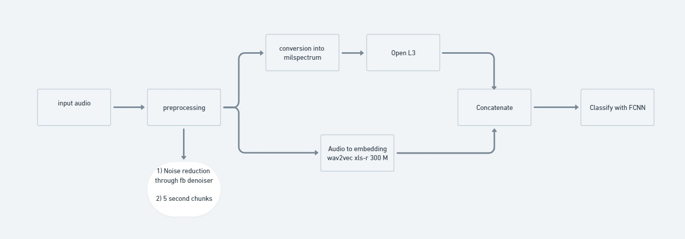
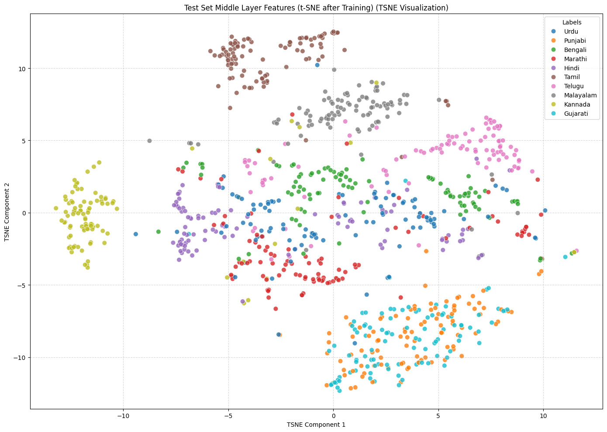
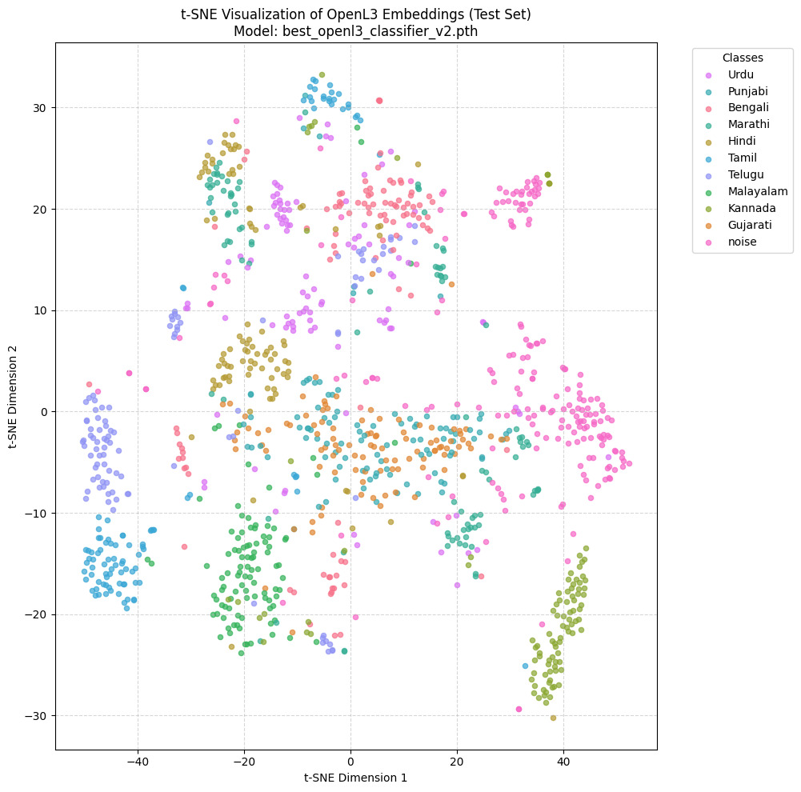
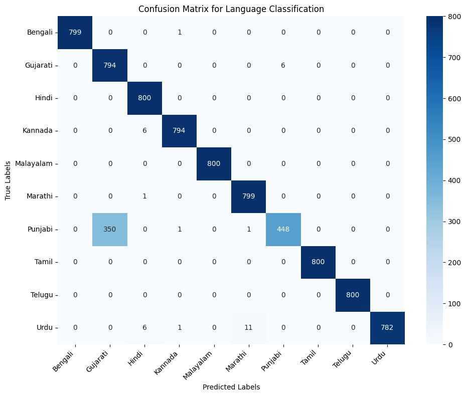
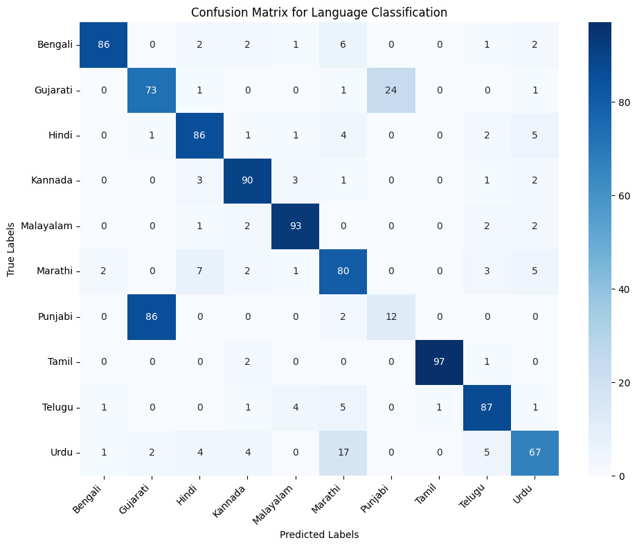

# Model 

## Model Architecture



We denoise the input audio, pad it and extravt embedding from xls-r 300 M which is based on Wav2vec

The audio is converted to Milspectrogram using the library ```librosa``` . This converts our audio classification to image classifcation. We use OpenL3 to differentiate tonality in languages and also classify between men and women

We concatenate the outputs from OpenL3 and xls-r and pass it through a FCNN for classification

## Inference

### t-SNE visualisation
1) For Middle layer in FCNN during classification



2) After OpenL3



### Confusion Matrix
1) After Training



2) After Training


